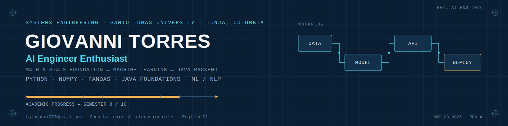

<h3 align="center">

  

  Welcome, I'm Giovanni Torres!

 

</h3>

Hey! I'm an 8th-semester Systems Engineering student at Universidad Santo Tomás (Tunja, Colombia), currently interning as an **AI Engineer**. 

I'm bilingual (English C1, lived in the US for 3 years) and I also have Java fundamentals from earlier coursework, so I move comfortably between backend logic and applied ML.

 

### Featured projects

| Project | Description |
|---|---|
| **[ML_ChatBot](https://github.com/tgiovanni277-ship-it/ML_ChatBot)** | Spanish conversational chatbot using RAG (Retrieval-Augmented Generation) |
| **[PDS-006-Servicios](https://github.com/tgiovanni277-ship-it/PDS-006-Servicios)** | System for tracking external technology and biomedical equipment |

 

------
Last edited on: 22/07/2026

